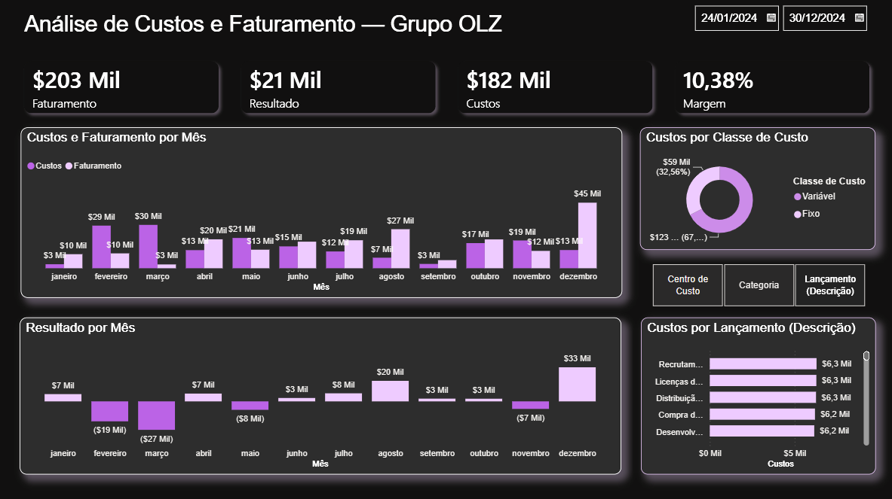

# Portifólio de projetos do Power BI

Bem-vindo(a) ao meu Portfólio pessoal de Power BI! Este repositório reúne meus estudos realizados durante o Bootcamp - GenAI, Dados &amp; Cyber.

## Sobre mim

Explorando a área de dados como parte da minha transição de carreira, aplicando o que aprendi em sala de aula e complementando com estudos online.
Este portfólio reúne projetos desenvolvidos em Power BI e outras ferramentas de análise, mostrando minha evolução prática e contínua no campo de Business Intelligence.

---

## [Projeto 1: Análise de Custos e Faturamento — Grupo OLZ](https://github.com/Lizlala/Grupo-Olz---Custos-e-Faturamento.git)

Projeto desenvolvido em Power BI para análise financeira do Grupo OLZ, cruzando dados de faturamento, custos e margem para identificar oportunidades de melhoria.

## Contato
If you have any questions, feedback, or collaboration opportunities, please feel free to reach out to me. You can contact me via email at [treenamu@outlook.com]().

Thank you for visiting my Data Analysis Portfolio! I hope you find my projects informative and insightful!!!

